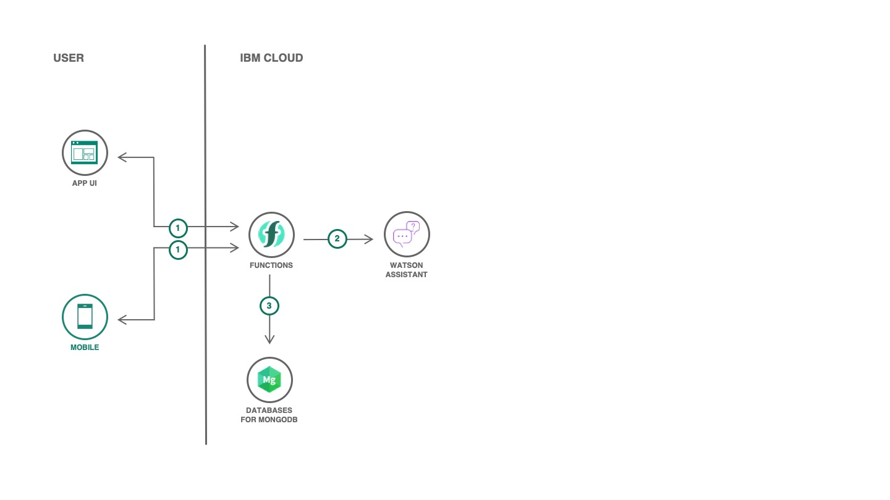

# Create a Serverless Chatbot for your business

[](https://cloud.ibm.com)
[](https://developer.ibm.com/technologies/node-js/)
[](https://github.com/victorshinya/serverless-chatbot/blob/master/LICENSE)
[](https://github.com/victorshinya/serverless-chatbot/pulls)

Use [IBM Cloud Functions](https://www.ibm.com/cloud/functions) and [Watson Assistant](https://www.ibm.com/cloud/watson-assistant-2/) service to create a **serverless** chatbot. There is no need to setup a Virtual Server (or Virtual Machine) or a Cloud Foundry to deploy and use your own chatbot. If you don't know how to build a chatbot, [read my blog](https://medium.com/ibmdeveloperbr/watson-assistant-como-criar-o-seu-chatbot-usando-skills-e-assistants-755b4677984b/).



## Components and technologies

* [IBM Cloud Functions](https://cloud.ibm.com/openwhisk): FaaS (Function-as-a-Service) platform that executes functions in response to events. It is based on Apache Openwhisk project.
* [Watson Assistant](https://cloud.ibm.com/catalog/services/watson-assistant): Watson Assistant lets you build conversational interfaces into any application, device, or channel.
* [MongoDB](https://cloud.ibm.com/catalog/services/databases-for-mongodb): MongoDB is a JSON document store with a rich query and aggregation framework.

## Deployment

To setup and deploy, you need to install [IBM Cloud CLI](https://cloud.ibm.com/docs/cli/reference/ibmcloud/download_cli.html#install_use) and [IBM Cloud Functions CLI](https://cloud.ibm.com/openwhisk/learn/cli) in your local machine and then, follow all steps below.

### 1. Clone this repository

```sh
git clone https://github.com/victorshinya/serverless-chatbot.git
cd serverless-chatbot
```

### 2. Open the project in a text editor

Replace on [`assistant.js`](src/assistant.js):

* [ Line 14 ] `{iam_apikey}` by your Watson Assistant's IAM_APIKEY
* [ Line 22, 29 ] `{assistant_id}` by your Watson Assistant's ASSISTANT_ID

Replace on [`mongodb.js`](src/mongodb.js):

* [ Line 17 ] `{mongodb_uri}` by your MongoDB URI
* [ Line 23 ] `{mongodb_db}` by your MongoDB Database name
* [ Line 24 ] `{mongodb_collection}` by your MongoDB Collection name

### 3. Deploy all functions

Run the following command to deploy both `assistant.js` and `mongodb.js` functions and create a sequence with all actions on IBM Cloud Functions. Required an account on [IBM Cloud](https://cloud.ibm.com).

> As you are using IBM Cloud Functions, you don't need to install any package or setup a `package.json`. The platform already ha

```sh
ibmcloud fn deploy --manifest manifest.yml
```

## LICENSE

Copyright 2020 Victor Shinya

Licensed under the Apache License, Version 2.0 (the "License");
you may not use this file except in compliance with the License.
You may obtain a copy of the License at

    http://www.apache.org/licenses/LICENSE-2.0

Unless required by applicable law or agreed to in writing, software
distributed under the License is distributed on an "AS IS" BASIS,
WITHOUT WARRANTIES OR CONDITIONS OF ANY KIND, either express or implied.
See the License for the specific language governing permissions and
limitations under the License.
